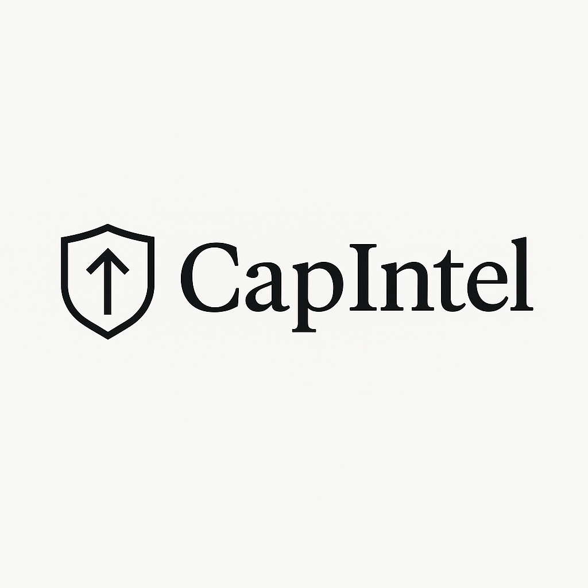

# 📈 CapIntel - AI-Powered VC Deal Sourcing & Due Diligence Platform

<div align="center">
  
  
  [](https://www.python.org/downloads/)
  [](https://streamlit.io/)
  [](https://langchain.com/)
  [](LICENSE)
</div>

## 🚀 Overview

CapIntel is an advanced AI-powered platform designed to revolutionize venture capital deal sourcing and due diligence processes. Built with cutting-edge AI agents and a modern web interface, it automates the complex workflow of identifying, analyzing, and evaluating investment opportunities across various industries.

### 🎯 Key Features

- **🤖 Multi-Agent AI System**: Four specialized AI agents working in harmony
- **📊 Comprehensive Analysis**: Industry research, company profiling, and investment thesis development
- **📈 Visual Analytics**: Interactive charts and data visualizations
- **📋 Automated Reporting**: Generate detailed due diligence reports
- **🎨 Modern UI**: Beautiful Streamlit-based web interface
- **⚡ Real-time Processing**: Live progress tracking and status updates

## 🏗️ Architecture

CapIntel employs a sophisticated multi-agent architecture with four specialized AI agents:

### 1. **Industry Researcher Agent** 🔍
- Analyzes market trends and industry dynamics
- Identifies growth opportunities and market gaps
- Evaluates competitive landscape
- Assesses regulatory environment

### 2. **Thesis Developer Agent** 💡
- Develops investment theses based on market analysis
- Identifies key investment themes and trends
- Evaluates market timing and entry strategies
- Assesses risk-reward profiles

### 3. **Company Sourcer Agent** 🎯
- Discovers potential investment targets
- Analyzes company profiles and metrics
- Evaluates founding teams and business models
- Assesses market positioning and competitive advantages

### 4. **Report Synthesizer Agent** 📋
- Compiles comprehensive due diligence reports
- Generates executive summaries and recommendations
- Creates visual charts and data representations
- Formats reports for stakeholder consumption

## 🖥️ Screenshots

### Main Application Interface


*The main CapIntel interface showing the comprehensive dashboard with report configuration options, progress tracking, and generated reports.*

## 🛠️ Installation & Setup

### Prerequisites
- Python 3.8 or higher
- Git
- Internet connection for AI model access

### Step 1: Clone the Repository
```bash
git clone https://github.com/ka312/CapIntel.git
cd CapIntel
```

### Step 2: Create Virtual Environment
```bash
python -m venv venv

# On Windows
venv\Scripts\activate

# On macOS/Linux
source venv/bin/activate
```

### Step 3: Install Dependencies
```bash
pip install -r requirements.txt
```

### Step 4: Run the Application
```bash
streamlit run app.py
```

The application will be available at `http://localhost:8501`

## 📋 Usage Guide

### 1. **Report Configuration**
- Select report type (Full Due Diligence, Industry Analysis, Company Profile, Investment Thesis)
- Enter target industry (e.g., Fintech, Healthcare, AI)
- Choose report length (Concise, Standard, Detailed)
- Configure additional options based on report type

### 2. **Report Generation**
- Click "Generate Report" to start the AI analysis
- Monitor progress through the real-time progress bar
- View status updates for each AI agent

### 3. **Report Review**
- Expand the generated report to view full analysis
- Download reports in Markdown or PDF format
- Access visualizations and charts
- Review historical reports in the report history section

## 📊 Report Types

### 🔍 **Full Due Diligence**
Comprehensive analysis including:
- Industry market analysis
- Company financial assessment
- Competitive landscape evaluation
- Risk assessment and mitigation strategies
- Investment recommendations

### 📈 **Industry Analysis**
Focused market research covering:
- Market size and growth projections
- Key trends and drivers
- Regulatory environment
- Investment opportunities
- Market entry strategies

### 🏢 **Company Profile**
Detailed company evaluation including:
- Business model analysis
- Financial performance metrics
- Team assessment
- Market positioning
- Growth potential evaluation

### 💡 **Investment Thesis**
Strategic investment framework with:
- Investment rationale
- Market opportunity assessment
- Risk-reward analysis
- Exit strategy considerations
- Portfolio fit evaluation

## 🏗️ Project Structure

```
CapIntel/
├── app.py                          # Main Streamlit application
├── company_sourcer.py              # Company sourcing AI agent
├── industry_researcher.py          # Industry research AI agent
├── thesis_developer.py             # Investment thesis AI agent
├── report_synthesizer.py           # Report generation AI agent
├── utils.py                        # Utility functions and state management
├── requirements.txt                # Python dependencies
├── assets/                         # Static assets (logos, images)
│   └── logo.png
├── reports/                        # Generated reports and charts
│   ├── charts/
│   └── *.md
└── README.md                       # This file
```

## 🔧 Configuration

### Environment Variables
Create a `.env` file in the project root:
```env
# API Keys (if required)
OPENAI_API_KEY=your_openai_api_key
DUCKDUCKGO_API_KEY=your_duckduckgo_api_key

# Application Settings
DEBUG=False
LOG_LEVEL=INFO
```

### Customization Options
- **Report Length**: Adjust detail level (Concise/Standard/Detailed)
- **Industry Focus**: Target specific sectors or technologies
- **Analysis Depth**: Configure financial analysis, competitor analysis, and risk assessment inclusion
- **Visualization**: Customize charts and data representations

## 🚀 Advanced Features

### 🤖 AI Agent Customization
Each AI agent can be customized for specific use cases:
- Modify research parameters
- Adjust analysis depth
- Customize output formats
- Add industry-specific criteria

### 📊 Data Export
- Export reports in multiple formats (Markdown, PDF, JSON)
- Download visualizations as high-resolution images
- Generate executive summaries
- Create presentation-ready materials

### 🔄 Report History
- Track all generated reports
- Compare different analyses
- Maintain audit trails
- Version control for reports

## 🤝 Contributing

We welcome contributions to CapIntel! Here's how you can help:

### 🐛 Bug Reports
- Use the GitHub issue tracker
- Provide detailed reproduction steps
- Include system information and error logs

### 💡 Feature Requests
- Describe the feature and its benefits
- Provide use cases and examples
- Consider implementation complexity

### 🔧 Code Contributions
1. Fork the repository
2. Create a feature branch (`git checkout -b feature/amazing-feature`)
3. Commit your changes (`git commit -m 'Add amazing feature'`)
4. Push to the branch (`git push origin feature/amazing-feature`)
5. Open a Pull Request

## 📄 License

This project is licensed under the MIT License - see the [LICENSE](LICENSE) file for details.

## 🙏 Acknowledgments

- **LangChain**: For the AI agent framework
- **Streamlit**: For the beautiful web interface
- **DuckDuckGo**: For search capabilities
- **Matplotlib & Seaborn**: For data visualization
- **Pandas**: For data manipulation

## 📞 Support

- **GitHub Issues**: [Report bugs or request features](https://github.com/ka312/CapIntel/issues)
- **Documentation**: Check the code comments and docstrings
- **Community**: Join our discussions in GitHub Discussions

## 🔮 Roadmap

### Upcoming Features
- [ ] **Real-time Market Data Integration**
- [ ] **Advanced Financial Modeling**
- [ ] **Portfolio Optimization Tools**
- [ ] **Collaborative Workspace**
- [ ] **API for Third-party Integrations**
- [ ] **Mobile Application**
- [ ] **Advanced NLP for Document Analysis**
- [ ] **Machine Learning for Pattern Recognition**

### Version History
- **v1.0.0**: Initial release with core AI agents and web interface
- **v1.1.0**: Enhanced reporting and visualization features
- **v1.2.0**: Advanced customization and export options

---

<div align="center">
  <p><strong>Built with ❤️ for the VC community</strong></p>
  <p>Transform your deal sourcing and due diligence process with AI-powered insights</p>
</div> 